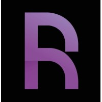
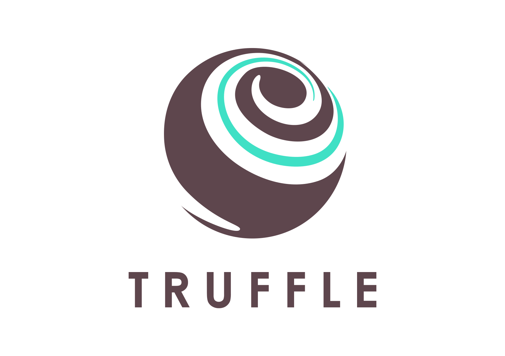
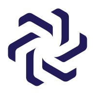

#

Hello, I'm **Franck**, a developer focused on **Blockchain** technologies and **Rust**, with a [**background**](https://www.linkedin.com/in/franckmaussand/) on **C & Assembly** industrial computing, **PHP** backend development, and expertise in **2D/3D graphics**.

Check out my **repositories** for insights into gas optimization strategies, EVM,  advanced Solidity practices and now... **Solana**.

> ▰ 🦀 **Rust Enthousiast** ▰ 🔗 **Blockchain Developper** ▰ 🚀 **Optimisation Addict** ▰  **Solana Fan** ▰ 🧙‍♂️ **Lawful Neutral** ▰

--------
# Activities and Interests

### ✍️  Blog posts

▶ Contributor to [**CoinsBench**](https://coinsbench.com), where blockchain developers share their stories, experiences & ideas.

<table>

  <tr>
    <td>🇬🇧 <b><a href="https://medium.com/@franck.maussand/solana-ethereum-function-visibility-41a293fe7078">Solana / Ethereum: Function Visibility</a></b> ✨</td>
    <td>🇫🇷 <b><a href="https://medium.com/@franck.maussand/solana-ethereum-functions-visibility-4c10ec2852c3">Solana / Ethereum : Visibilité des fonctions</a></b></td>
  </tr>

  <tr>
    <td>🇬🇧 <b><a href="https://medium.com/coinsbench/pow-pos-poh-a-simple-guide-to-blockchain-consensus-mechanisms-6985e983e0b2">PoW, PoS, PoH: A Simple Guide to Blockchain Consensus Mechanisms</a></b> ✨
    </td>
    <td>🇫🇷 <b><a href="https://medium.com/@franck.maussand/pow-pos-poh-guide-simple-mecanismes-consensus-blockchain-ee88b76a1001">PoW, PoS, PoH : Guide des consensus</a></b>
    </td>
  </tr>

  <tr>
    <td>🇬🇧 <b><a href="https://medium.com/@franck.maussand/optimization-on-ethereum-make-a-difference-with-function-names-9cc4a963424b">Optimization on Ethereum: Make a Difference ...</a></b></td>
    <td>🇫🇷 <b><a href="https://medium.com/@franck.maussand/optimisation-sur-ethereum-faites-la-diff%C3%A9rence-avec-les-noms-de-fonctions-ba4692c9e39f">Optimisation sur Ethereum : Faites la différence ...</a></b></td>
  </tr>

  <tr>
    </td>
    <td>🇫🇷 <b><a href="https://github.com/Laugharne/m4_le_langage_de_traitement_de_macros">M4 le langage de traitement de macros</a></b></td>
    <td>🇫🇷 <b><a href="https://www.tumblr.com/laugharne-me/56910153196/php-typage-parametres-fonctions">PHP : Typage des paramètres de fonctions</a></b>
    </td>
  </tr>

  <tr>
    </td>
    <td>🇬🇧 <b><a href="https://medium.com/@franck.maussand/securing-solana-programs-avoiding-common-pitfalls-in-rust-and-anchor-development-f3a863b43d34">Avoiding Common Pitfalls in Rust & Anchor Development</a></b> ✨</td>
    <td>🇬🇧&nbsp;<b><a href="https://medium.com/coinsbench/exploring-the-solana-token-extensions-22b5f9bf45d8">Exploring the Solana Token Extensions</a></b> ✨</td>
  </tr>

  <tr>
    </td>
    <td>🇬🇧 <b><a href="https://medium.com/coinsbench/understanding-std-mem-take-in-rust-b4b44e49406f">Understanding `std::mem::take` in Rust</a></b></td>
    <td></td>
  </tr>

</table>

----
###   Solana

▶ Engaging in comprehensive bootcamps to unravel **Solana**'s intricacies, covering architecture, key concepts, and empowering developers to craft smart contracts.

▶ I actively follow **Solana**, an invaluable resource offering accessible coding tutorials, guiding me through the journey of building exciting projects on the **Solana blockchain**.

<table>
  <tr>
    <td>☀️&nbsp;<b><a href="https://github.com/Laugharne/solana_summer_fellowship_2024">Solana Summer Fellowship</a></b> ✨</td>
    <td>⚓ <b><a href="https://github.com/Laugharne/mutatis_mutandis">Mutatis Mutandis</a></b> ✨</td>
  </tr>
  <tr>
    <td>🎓&nbsp;<b><a href="https://certificate.bcdiploma.com/check/7887621B9350112FFD5C61342AFA7E6391D8750CC104CDE22FCC093411E6289Aalg4djZ4QW8rYmFEZXpKTDduY0hSK1JrU0JYOHJZN0JTUjZmdk9wYnpvZFNGUFQr">Alyra x Solana Foundation</a></b> ✨</td>
    <td>&nbsp;<b><a href="https://github.com/Laugharne/ato">ATO : Autonomous Trading Organization</a></b></td>
  </tr>
  <tr>
    <td>✍️ <b><a href="https://medium.com/@franck.maussand/solana-ethereum-function-visibility-41a293fe7078">Solana / Ethereum: Function Visibility</a></b> ✨</td>
    <td>⚓ <b><a href="https://github.com/Laugharne/abf_anchor_build_fixer">ABF : Anchor Build Fixer</a></b> ✨</td>
  </tr>
  <tr>
    <td>&nbsp;<b><a href="https://github.com/Laugharne/solana_rareskills">60 days of Solana (RareSkills Courses)</a></b> ✨</td>
    <td>&nbsp;<b><a href="https://github.com/Laugharne/solana_calyptus">Solana learning (Calyptus Courses)</a></b> ✨</td>
  </tr>
  <tr>
    <td>&nbsp;<b><a href="https://github.com/Laugharne/solana_token_extensions">Solana Token Extensions overview</a></b> ✨</td>
      <td>&nbsp;<b><a href="https://github.com/Laugharne/solana_foundation_tutorials">Solana Foudation Tutorials</a></b></td>
  </tr>
  <tr>
    <td>&nbsp;<b><a href="https://github.com/Laugharne/solana_bootcamp">Solana Bootcamp</a></b></td>
    <td>&nbsp;<b><a href="https://github.com/Laugharne/solana_bytes">Solana Bytes</a></b></td>
  </tr>
    <td>✍️ <b><a href="https://medium.com/@franck.maussand/securing-solana-programs-avoiding-common-pitfalls-in-rust-and-anchor-development-f3a863b43d34">Avoiding Common Pitfalls in Rust & Anchor Development</a></b> ✨</td>
    <td>&nbsp;<b><a href="https://github.com/Laugharne/solana_optimized_programs">Writing Optimized Solana Programs (retranscription)</a></b></td>
  </tr>

</table>

----
###   Ethereum

▶ I am deeply interesting about the **Ethereum** blockchain and **Solidity** language, with a keen focus on optimizing gas costs—a pivotal challenge in the development of smart contracts.

▶ For an in-depth understanding, I continually educate myself.

<table>

  <tr>
    <td><b><a href="https://medium.com/@franck.maussand/optimization-on-ethereum-make-a-difference-with-function-names-9cc4a963424b">Optimization on Ethereum: Make a Difference ...</a></b></td>
    <td><b><a href="https://github.com/Laugharne/Optimal_Function_Names">Optimisation sur Ethereum : Faites la différence ...</a></b></td>
  </tr>

  <tr>
    <td>🦀 <b><a href="https://github.com/Laugharne/select0r">Select0r tool</a></b> ✨</td>
    <td><b><a href="https://github.com/Laugharne/gas_optimization_panel">Gas Optimization Pannel With ...</a></b></td>
  </tr>

  <tr>
    <td><b><a href="https://github.com/Laugharne/EVM_Technical_walkthrough">EVM Technical walkthrough</a></b></td>
    <td><b><a href="https://github.com/Laugharne/advanced_solidity_gas_optimisation">Advanced Solidity : Gas Optimisation</a></b></td>
  </tr>

  <tr>
    <td><b><a href="https://github.com/Laugharne/cheap_contract_deployment_through_clones">Cheap Contract Deployment Through Clones</a></b></td>
    <td>&nbsp;<b><a href="https://github.com/Laugharne/alyra_dapp_deploy">Truffle Project Deployment (Vercel+Goerli)</a></b></td>
  </tr>

  <tr>
    <td>&nbsp;<b><a href="https://github.com/Laugharne/coverage_hh">Test coverage of a Truffle project with HardHat</a></b></td>
    <td>&nbsp;<b><a href="https://docs.google.com/presentation/d/1_VGALq5puhRKeQGUGATBOHusYdewv5ewNE0Bz45g6ro/edit?usp=sharing">Alyra, l'école blockchain - Mémoire RS5000</a></b> ✨</td>
  </tr>

  <tr>
    <td>🦀 <b><a href="https://github.com/Laugharne/rust-nft-api">Rust NFT API (fork)</a></b></td>
    <td></td>
  </tr>

</table>

----
### 🦀  Rust

▶ Rust is the language I've been waiting for all along.

<table>

  <tr>
    <td> <b><a href="https://github.com/Laugharne/select0r">Select0r</a></b> ✨</td>
    <td>🎓 <b><a href="https://github.com/Laugharne/udemy_the_complete_rust_programming_course">The complete RUST programming course</a></b> ✨</td>
    </td>
  </tr>

  <tr>
    <td>🦀 <b><a href="https://github.com/Laugharne/advent_of_code_2023">Advent of Code 2023</a></b>
    <td>🦀 <b><a href="https://github.com/Laugharne/wasm-game-of-life">WASM Game of Life</a></b>
    </td>
  </tr>

  <tr>
    <td>🔘 <b><a href="https://github.com/Laugharne/rust-nft-api">Rust NFT API (fork)</a></b></td>
    <td>🦀 <b><a href="https://github.com/Laugharne/rust_string_guide">Working with Strings in Rust</a></b>
    </td>
  </tr>

  <tr>
    <td>⚓ <b><a href="https://github.com/Laugharne/mutatis_mutandis">Mutatis Mutandis</a></b> ✨</td>
    <td>🦀 <b><a href="https://github.com/Laugharne/rust_compiler_deep_dive">How the Rust Compiler Works, a Deep Dive</a></b>
    </td>
  </tr>

  <tr>
    <td>✍️ <b><a href="https://medium.com/coinsbench/understanding-std-mem-take-in-rust-b4b44e49406f">Understanding std::mem::take
</a></b></td>
    <td>
    </td>
  </tr>
</table>

----
### 🖥️  Technologies & Tools

▶ Some of the tools & technologies I have used during my professional career.

&nbsp;&nbsp; &nbsp; &nbsp; &nbsp;  &nbsp; &nbsp;&nbsp; &nbsp; &nbsp; &nbsp; &nbsp;&nbsp; &nbsp; &nbsp;&nbsp; &nbsp; &nbsp;&nbsp;

----
### 🎓  Certificates

<table>

  <tr>
    <td>&nbsp;<b><a href="https://certificate.bcdiploma.com/check/7887621B9350112FFD5C61342AFA7E6391D8750CC104CDE22FCC093411E6289Aalg4djZ4QW8rYmFEZXpKTDduY0hSK1JrU0JYOHJZN0JTUjZmdk9wYnpvZFNGUFQr">Alyra : Solana Blockchain Developper</a></b></td>
    <td>&nbsp;<b><a href="https://certificate.bcdiploma.com/check/0770624BBEEFA3F9CFD293BCD4B0598BF90C51C741E0633E6935538F6CE05FECdVN0Mnp0M3k2NFJPVm9VQ0ZSa1pibTdWL2c1TUtRUUp6UnRKcUdIMWt1VjFpdU5G">Alyra : EVM Blockchain Developper</a></b></td>
  </tr>

  <tr>
    <td>&nbsp;<b><a href="https://www.udemy.com/certificate/UC-5135d45b-70ee-46e5-9d3e-8b859e4ba161/"> Advanced Solidity: Understanding & Optimizing Gas Costs</a></b>
    </td>
    <td>&nbsp;<b><a href="https://www.udemy.com/certificate/UC-ef9438ea-92b7-4f42-a91e-46ff28006419/"> Advanced Solidity: Yul and Assembly</a></b></td>
  </tr>

  <tr>
    <td>&nbsp;<b><a href="https://www.udemy.com/certificate/UC-82d2d8e0-8e3d-43b3-adb1-631ccaa59b73/">The Complete Rust Programming Course</a></b>
    </td>
    <td></td>
  </tr>

</table>

----
## ➡️  Links

 ▰ **[Email](mailto:franck@maussand.net)** ▰ **[LinkedIn](https://www.linkedin.com/in/franckmaussand/)** ▰ **[GitHub](https://github.com/Laugharne)** ▰ **[Medium](https://medium.com/@franck.maussand)** ▰ **[**CoinsBench**](https://coinsbench.com)** ▰ **[Tumblr](https://www.tumblr.com/laugharne-me)** ▰ **[diigo](https://www.diigo.com/user/laugharne_me)** ▰

----
